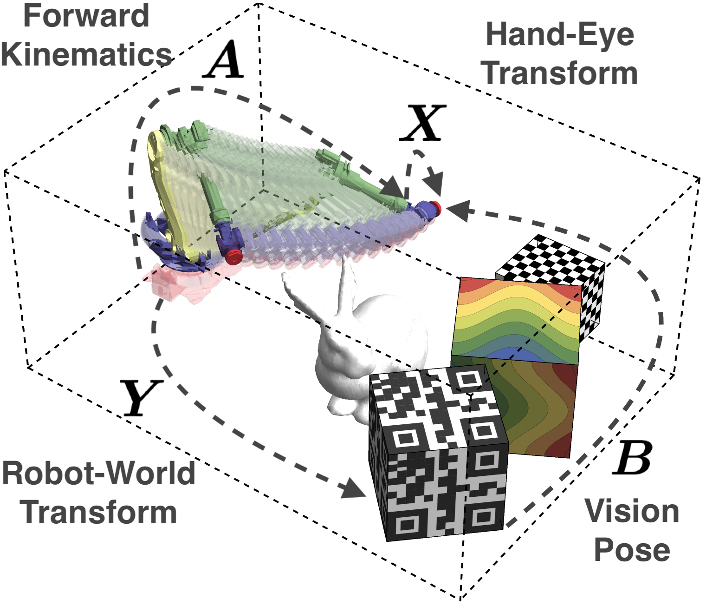

# Pure-Translation Hand-Eye Robot-World Calibration

[](https://opensource.org/licenses/MIT)
[](https://github.com/JokerJohn/AM_Align/stargazers)
[](https://github.com/JokerJohn/AM_Align/issues)

The method is a globally optimal method for solving the pure-translation hand-eye robot-world calibration (HERWC) problem. The package provides a complete set of algorithms, making it a convenient solution for improving the accuracy and robustness of robotic coordination systems.


<div align="center">


</div>

## News
- **2024/06/13**: Submitted as a  Journal paper.

## Features

- The HERWC problem is revisited with special concern on the pure-translation equation, by which we reveal that all the translation and some rotation parts can be recovered based on this constraint.
- Theoretical analysis show the solution process of the induced optimization problem, being a non-convex one in the special Euclidean group. Via symbolic computations, we conclude that the new optimization problem can be solved in the way of Quadratic Pose Estimation Problems (QPEPs). We design efficient elimination templates for this specific optimization task.
- Through simulation and experiments, it is shown that the pure- translation HERWC may generate more accurate translation estimation results, compared to representatives.

## Prerequisites

- C++11 or newer
- CMake 3.10 or newer
- Eigen3
- Optional: MATLAB codes

## Installation

1. Clone the repository:

```bash
git clone https://github.com/zarathustr/AXYB-Translation
```

2. Build the project:

```bash
cd AXYB-Translation
mkdir build && cd build
cmake ..
make
```

## Contributing

We welcome contributions to this repo! If you have any ideas, suggestions, or bug reports, please open an issue or submit a pull request. For major changes, please discuss them with the authors first.

Before contributing, please read our [contributing guidelines](CONTRIBUTING.md) and [code of conduct](CODE_OF_CONDUCT.md).

## License

This repo is released under the [MIT License](LICENSE).

## Citation

If you use this work in your research, please cite our papers:

1. **Wu, J.**, et al. (2024)
 On Pure-Translation Hand-Eye Robot-World Calibration, ***Submitted to IEEE/ASME Transactions on Mechatronics***.
 
2. **Wu, J.**, et al. (2022)
  Quadratic Pose Estimation Problems: Globally Optimal Solutions, 
  Solvability/Observability Analysis and Uncertainty Description, ***IEEE Transactions on Robotics***, https://doi.org/10.1109/TRO.2022.3155880.

## Acknowledgments

We would like to thank the following authors for their contributions and support.

## Contact

For questions, comments, or suggestions, please contact jin_wu_uestc@hotmail.com.
